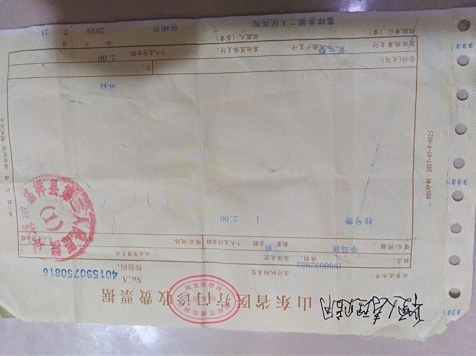
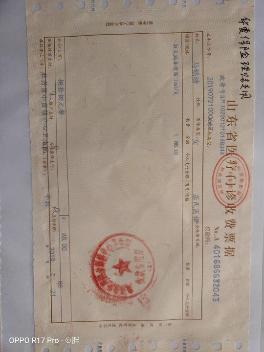
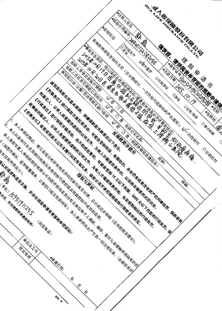
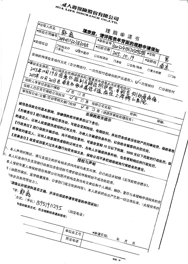

 # **文字方向校正**  
 文字方向校正在本文中分为两个步骤:文本块形态校正和模型方向校正，文本块方向校正主要是检测文本块的  
边界线，计算边界线的角度旋转图像即小角度校正，小角度的范围|0-90|之间。检测旋转完之后再由模型做  
大角度的方向判断，大角度为0\90,180,270四个角度。直接看效果图  

 ## 图像1
   
   
 ## 图像2
   
   
 ## 图像3
   
   
 ## 图像4
   
   